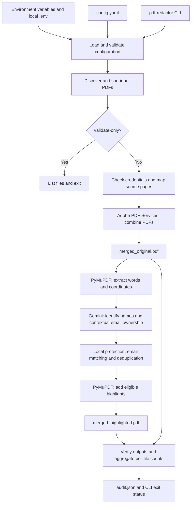

# Employee PDF Highlighter

Merge every PDF directly inside `input/`, preserve page content, and highlight human names and email addresses except those belonging to configured protected people. Names are identified by Gemini; there is no spaCy or local name heuristic. Adobe PDF Services performs PDF combination. PyMuPDF extracts word coordinates and adds yellow PDF annotations locally.

Highlights leave information readable and removable. This application does not redact or erase data.

## Contents

- [Architecture and file structure](#architecture)
- [Pipeline in detail](#pipeline-in-detail)
- [Audit report and failure behavior](#audit-report-and-failure-behavior)
- [Setup](#setup-powershell)
- [Environment configuration](#environment-configuration)
- [Configure and run](#configure-and-run)
- [Detection and protection rules](#how-detection-and-protection-work)
- [Migrating and troubleshooting](#migrating-and-troubleshooting)
- [Limits and data flow](#limits-and-data-flow)
- [Development](#development)

## Architecture

This is a Python command-line application with a sequential pipeline. `processing.py` coordinates independent modules for discovery, merging, extraction, identification, highlighting, and reporting. Shared dataclasses in `models.py` carry configuration, page mappings, text coordinates, and detections between modules.



The single-input path copies the PDF to `merged_original.pdf` without an Adobe combine request. Gemini receives word text and word IDs, while the word coordinates remain local. Adobe receives complete PDFs for combination. Neither provider draws the final highlights: the application uses the returned word references to annotate the downloaded PDF locally.

### Repository structure

```text
Employee-Highlighter/
|-- README.md                         # Setup, architecture and operating guide
|-- pyproject.toml                    # Dependencies, packaging and CLI entry point
|-- .gitignore                        # Ignore local secrets and generated artifacts
|-- .env.example                      # Empty service/model environment template
|-- .env                              # Your local values; create from the template
|-- config.example.yaml               # Example document-processing settings
|-- config.yaml                       # Your local settings; create from the example
|-- input/                            # Source PDFs; direct children only
|-- output/
|   |-- merged_original.pdf           # Combined PDF before new annotations
|   |-- merged_highlighted.pdf        # Combined PDF with eligible highlights
|   `-- audit.json                    # Per-file counts and verification results
|-- src/
|   `-- pdf_redactor/
|       |-- __init__.py
|       |-- cli.py                    # Argument parsing, logging and exit codes
|       |-- config.py                 # .env loading and YAML validation
|       |-- discovery.py              # Deterministic PDF discovery
|       |-- models.py                 # Shared dataclasses and PII enum
|       |-- processing.py             # Pipeline orchestration and audit writing
|       |-- adobe/
|       |   |-- __init__.py
|       |   `-- merge.py              # Adobe SDK uploads, combine jobs and batching
|       |-- extraction/
|       |   |-- __init__.py
|       |   `-- pymupdf.py            # Coordinate-aware word extraction
|       |-- identification/
|       |   |-- __init__.py
|       |   `-- detector.py           # Gemini schema/calls and local protection
|       `-- highlighting/
|           |-- __init__.py
|           `-- pymupdf.py            # PDF highlight annotation creation
`-- tests/
    |-- test_config.py                # Settings, .env precedence and migration
    |-- test_discovery.py             # Filename filtering and ordering
    |-- test_adobe.py                 # Merge batching and order
    |-- test_identification.py        # Protection, model selection and span checks
    |-- test_processing.py            # Pipeline with generated PDFs/mock services
    `-- test_sdk_contracts.py         # Installed SDK request/download compatibility
```

`.env` and `config.yaml` are user-created files. `output/` contains runtime artifacts. Installed package metadata (`*.egg-info`) and Python caches (`__pycache__`) are generated files, not pipeline modules.

### Modules and interfaces

| Module | Main interface | Responsibility and result |
| --- | --- | --- |
| `cli.py` | `main(argv)` | Reads `--config` and `--validate-only`, logs queued files, runs processing and returns an exit code. |
| `config.py` | `load_config(path)` | Loads the current directory's `.env`, parses YAML and returns `ProcessingConfig`. Rejects invalid highlight/chunk/retry settings, enabled OCR and YAML model settings. |
| `discovery.py` | `discover_pdfs(input_folder)` | Returns a sorted list of direct-child PDF paths. Rejects a missing input folder or a path that is not a directory. |
| `processing.py` | `run(config_path)` | Coordinates services and local processing, saves the PDFs, builds an `AuditReport` and writes JSON. `_source_pages()` builds provenance; `_verify()` checks final outputs. |
| `adobe/merge.py` | `merge_pdfs(paths, destination)` | Combines ordered inputs using Adobe, or copies a single input. `_combine()` uploads assets, submits a job, retrieves its result and downloads bytes. |
| `extraction/pymupdf.py` | `extract_words(document)` | Returns `TextElement` objects from sorted PDF words, including merged page numbers and original word rectangles. |
| `identification/detector.py` | `GeminiDetector.identify()` and `detect_pii()` | Requests structured entities, validates word IDs, applies configured PII filters/protection and returns coordinate-backed `DetectedPii` objects. |
| `highlighting/pymupdf.py` | `add_highlights(document, detections, color, opacity)` | Skips protected detections, rejects conflicting overlaps, adds PDF annotations and returns the number added. |

### Data models and page numbering

| Model | Contents | Use |
| --- | --- | --- |
| `ProcessingConfig` | Folders, protected values, PII types, highlight options and processing settings | Carries validated YAML settings. Credentials and the Gemini model are read separately from the environment. |
| `SourcePage` | Source path, source page number, merged page number | Associates detections with their original file for the audit. |
| `BoundingBox` | `left`, `top`, `right`, `bottom` | Stores the rectangle used for annotation placement. |
| `TextElement` | Page number, word text and bounds | Connects extracted text to existing PDF page coordinates. |
| `DetectedPii` | PII type, value, page number, bounds and `protected` flag | Defines one annotation candidate or protected rectangle. |
| `FileAudit` | Path, status, pages, detection counts, highlight count and error field | Represents one source file in the JSON report. |
| `AuditReport` | File audits and verification fields | Returned to the CLI and serialized to `audit.json`. |

Source and merged page numbers in these models are **1-based**. PyMuPDF page access is **0-based**, so annotation code subtracts one. Gemini word IDs are **0-based within each request chunk**; the detector adds the chunk offset before locating the corresponding page words. The `Highlight` dataclass also exists in `models.py`, but the current pipeline passes `DetectedPii` directly to the annotation module.

For example, merging a two-page `a.pdf` followed by a one-page `b.pdf` produces this mapping:

| Source file | Source page | Merged page |
| --- | --- | --- |
| `a.pdf` | 1 | 1 |
| `a.pdf` | 2 | 2 |
| `b.pdf` | 1 | 3 |

## Pipeline in detail

### 1. Startup and input discovery

The `pdf-redactor` command is registered in `pyproject.toml` as `pdf_redactor.cli:main`. The CLI loads configuration and logs the discovered files. In validation mode it exits at this point. For a processing run, `run()` loads configuration/discovery again, rejects an empty input list, creates the output folder, checks Adobe credential presence, inspects source page counts/password requirements and initializes the Gemini client from the environment. Credential presence checks do not establish whether credentials are valid remotely.

### 2. Adobe combination

Each combine operation constructs Adobe service-principal credentials, uploads PDFs as assets in source order, adds those assets to `CombinePDFParams`, submits `CombinePDFJob`, retrieves `CombinePDFResult` and downloads the resulting asset. Intermediate combined PDFs are stored in a temporary directory that is cleaned up when merging finishes or fails.

The batching loop groups at most 20 files per operation. With 43 inputs, the first round combines groups of 20, 20 and 3; the next round combines those three results. A group containing a single file is carried forward without an unnecessary combine call. The final result is copied to the configured original-output path. The pipeline checks the downloaded PDF's page count against the source page map before extraction.

### 3. Word extraction and Gemini requests

PyMuPDF reads `page.get_text("words", sort=True)` and retains text plus bounds. The pipeline checks that each merged page yielded searchable words. The detector groups words by page and submits chunks of at most `gemini.chunk_words`, using a stride of `chunk_words - 32`. Requests never span pages.

A simplified request payload looks like this:

```json
{
  "protected_persons": ["Elena Rostova"],
  "words": [
    {"id": 0, "text": "Alice"},
    {"id": 1, "text": "Smith"},
    {"id": 2, "text": "alice@example.com"}
  ]
}
```

The system instruction asks for human names and emails, includes protected people for local handling, and treats document words as untrusted content. Generation uses temperature zero, JSON output and the schema defined in `detector.py`. The client has a 60-second HTTP timeout. An illustrative response is:

```json
{
  "entities": [
    {"type": "name", "start": 0, "end": 1, "owner": ""},
    {"type": "email", "start": 2, "end": 2, "owner": ""}
  ]
}
```

`start` and `end` are inclusive IDs. `owner` is an exact configured protected-person name only when Gemini establishes email ownership from the supplied context; otherwise it is empty. Local code requires integer IDs in range, supported entity types and string owners. Invalid JSON or invalid entity fields trigger bounded retries. A returned email span that fails local email syntax validation stops processing.

### 4. Local filtering, protection and rectangles

Local matching records configured protected-name word positions before applying Gemini entities. Returned entities are filtered by `pii_types`; chunk offsets restore page-level word positions. Identical entity spans from overlapping chunks are consolidated, preserving protection if either result marks the span protected.

Email syntax and optional employee-ID regex matches add candidates independently of Gemini. After all pages have been processed, protected email addresses established anywhere in the run are propagated to every matching email detection. This makes protection consistent across source files as well as pages.

For each entity, the detector unions its word boxes into a rectangle per line. A change of more than three units in word top coordinates starts a new line group. Identical rectangles of the same PII type on the same page are deduplicated. The entity text comes from the actual referenced PDF words, rather than a model-generated replacement string.

### 5. Annotation and output verification

The annotation module opens the existing merged pages, skips protected candidates, checks eligible rectangles against protected rectangles and adds highlight annotations with the configured color and opacity. It saves a separate highlighted PDF; it does not rebuild pages from extracted text. The Gemini client is closed after this processing stage, including when that stage fails.

The pipeline reopens both output PDFs, aggregates detections by source-page mapping, calculates verification fields and writes the audit. The CLI then requires the four Boolean verification checks below to pass before returning success.

## Audit report and failure behavior

`audit.json` has two top-level keys: `files` and `verification`. Each processed source entry includes its path, page count, detection counts by type and highlight count. Detection counts include protected candidates. Counts represent **rectangle candidates**, not unique people: repeated names count again, and a multiline name can contribute more than one candidate.

| Verification field | Meaning |
| --- | --- |
| `source_page_count`, `original_page_count`, `highlighted_page_count` | Page totals at each stage. |
| `page_count_match` | Both outputs and the source map have the same page count; required by the CLI. |
| `page_order_preserved` | The expected ordered list of source filename, source page and merged page triples. This is provenance data, not an independent content comparison that proves Adobe preserved order. |
| `page_dimensions_match` | Original and highlighted page rectangles match; required by the CLI. This compares the two outputs, not each source page to Adobe's result. |
| `protected_detections` | Number of protected rectangle candidates. |
| `protected_information_not_highlighted` | No highlight annotation rectangle in the highlighted output intersects a protected candidate; required by the CLI. Includes preexisting highlights. |
| `eligible_detections` | Number of unprotected rectangle candidates. |
| `highlights_added` | Number of annotations added during this run. |
| `all_eligible_detections_highlighted` | Eligible candidate count equals added annotation count; required by the CLI. It does not independently inspect every annotation or prove all real-world names were detected. |

Processing stops on an input or service failure; files are not silently skipped. Gemini retries malformed responses and service codes `429`, `500`, `502`, `503` and `504`, with additional attempts controlled by `retry_count` and backoff capped at eight seconds. Other exceptions stop the request. Adobe jobs are not automatically resubmitted by the application's merge wrapper.

The audit is written only after annotation processing and output verification calculations complete. Earlier failures are logged to the terminal and do not produce a fresh failure audit, although `FileAudit` has an error field for future use. A Boolean verification failure still has an audit and returns exit code `4`. Outputs are written in stages rather than as an atomic set; retain the exit status and review timestamps when diagnosing an interrupted run.

## Setup (PowerShell)

Requires Python 3.11 or newer and internet access to both services.

```powershell
python -m venv .venv
.\.venv\Scripts\Activate.ps1
python -m pip install -e ".[test]"
Copy-Item config.example.yaml config.yaml
Copy-Item .env.example .env
```

Create a Gemini API key in [Google AI Studio](https://aistudio.google.com/apikey). Create Adobe PDF Services credentials using [Adobe's getting-started guide](https://developer.adobe.com/document-services/docs/overview/pdf-services-api/gettingstarted).

## Environment configuration

Open `.env` and fill in these four values. Copy the exact Gemini model ID from the model you intend to use with your API key; the application does not choose a model or supply a fallback.

```dotenv
GEMINI_API_KEY=your-gemini-api-key
GEMINI_MODEL=your-exact-model-id
PDF_SERVICES_CLIENT_ID=your-adobe-client-id
PDF_SERVICES_CLIENT_SECRET=your-adobe-client-secret
```

The values above are placeholders; replace all of them before processing.

| Variable | What to paste | Required for processing |
| --- | --- | --- |
| `GEMINI_API_KEY` | Your Gemini API key | Yes |
| `GEMINI_MODEL` | The exact model ID available to that key, supporting structured JSON output | Yes |
| `PDF_SERVICES_CLIENT_ID` | The client ID from your Adobe PDF Services credentials | Yes |
| `PDF_SERVICES_CLIENT_SECRET` | The matching Adobe client secret | Yes |

Adobe combination uses PDF Services jobs and requires no AI model name. For Gemini, credentials and a model ID are separate settings: the key authenticates the request and `GEMINI_MODEL` selects the model. Change that environment value to change models; no Python or YAML edit is needed.

The application loads `.env` from the **current working directory**, not the directory of the YAML file. Run commands from the repository root when using the `.env` copied above. Existing terminal or deployment environment variables take precedence over `.env`, even if their values are empty. Remove a stale terminal variable if you want the file's value to apply. `.env` is ignored by Git; `.env.example` contains only empty fields and is safe to share. Never paste secrets into source code, YAML, or documentation.

Alternatively, set environment variables directly in the same PowerShell terminal that runs the application:

```powershell
$env:GEMINI_API_KEY = "your-gemini-key"
$env:GEMINI_MODEL = "your-exact-model-id"
$env:PDF_SERVICES_CLIENT_ID = "your-adobe-client-id"
$env:PDF_SERVICES_CLIENT_SECRET = "your-adobe-client-secret"
```

With these terminal variables set, a `.env` file is optional. Deployment platforms can supply the same four variables directly. There is no hardcoded Gemini model in the application or example configuration.

## Configure and run

Edit `config.yaml`:

```yaml
input_folder: ./input
output_folder: ./output
protected_persons:
  - Elena Rostova
protected_emails:
  - elena.rostova@example.com  # Replace with the actual protected address
pii_types: [name, email]
gemini:
  chunk_words: 400
highlight:
  color: [1.0, 1.0, 0.0]
  opacity: 0.35
processing:
  retry_count: 3
  ocr_enabled: false
```

Folder paths are relative to the current working directory. Input discovery is nonrecursive and sorts filenames case insensitively, with a deterministic tie breaker; `.PDF` is accepted. Keep output separate from input so previous results are not included in future runs.

```powershell
pdf-redactor --config config.yaml --validate-only
pdf-redactor --config config.yaml
```

Validation loads `.env`, checks configuration, and lists input files without requiring service variables or making API calls. It does not verify credentials, model availability, or quotas. Processing requires all four environment variables and reports a missing model or credential before contacting a service. Outputs overwrite the same filenames on successful reruns:

- `output/merged_original.pdf`: Adobe's combined PDF before new highlights.
- `output/merged_highlighted.pdf`: the same pages with highlight annotations.
- `output/audit.json`: per-file page/detection/highlight counts, source page mapping, and checks of page counts, dimensions, protected overlap and highlight coverage.

Exit codes: `0` success, `1` processing failure, `2` configuration/discovery failure, `4` output verification failure. A failed run may leave the original merge or files from an earlier run; check the exit code before using outputs.

## How detection and protection work

1. Validate source PDFs and construct the source-to-merged page map.
2. Upload PDFs to Adobe, submit Combine PDF jobs, download the result. More than 20 inputs are combined in successive batches while preserving order. A single input is copied because no combination is needed. There is no local merge fallback.
3. Extract searchable words and their page coordinates locally.
4. Send page words to Gemini in bounded chunks with 32 words of overlap. Gemini returns structured JSON with inclusive word IDs for each name/email occurrence and contextual protected email ownership. Local code validates spans, removes duplicates, and maps them to rectangles. Multiline names use separate rectangles per line.
5. Match configured protected names locally using case-insensitive, whitespace-normalized full names. Configure additional aliases in `protected_persons` if abbreviated names must be protected. Exact name matches are protected even if Gemini omits them. A Gemini span overlapping a protected name is also protected.
6. Detect email syntax locally to cover model omissions. Protect addresses explicitly listed in `protected_emails` and addresses Gemini links to a configured protected person using page context. Established protected addresses are protected on every page. Ambiguous addresses are highlighted: list every protected address explicitly for guaranteed exclusion. Email usernames alone are not used to infer ownership.
7. Add highlights for eligible detections and verify that no highlight overlaps a protected detection. Conflicting overlapping detections stop processing for review.

`pii_types` accepts `name`, `email`, and optional `employee_id`. Employee IDs use `employee_id_patterns` regular expressions and are not assigned person ownership. Gemini identifies names and email ownership; email syntax and employee IDs use regular expressions.

`GEMINI_MODEL` is read from the environment when processing starts and has no default. YAML's `gemini` section configures only chunking. `chunk_words` must be at least 64. `retry_count` controls additional Gemini attempts for malformed responses, rate limits and selected server errors, with bounded backoff. Adobe failures stop the run without automatic resubmission. Processing is sequential; legacy `concurrency` and `continue_on_error` fields are accepted for configuration compatibility but do not enable parallel work or skipping failed files.

## Migrating and troubleshooting

If your existing `config.yaml` contains `gemini.model`, remove that line and paste its value into `GEMINI_MODEL` in `.env`. The application rejects the old YAML setting with a migration message so a stale value cannot silently select the wrong model. Keep `gemini.chunk_words` in YAML.

- **`Set GEMINI_MODEL ...`**: fill in the model field, confirm you are running from the folder containing `.env`, and check for an empty terminal override. There is deliberately no default.
- **Missing credential message**: fill in the named environment variable. Adobe's client ID and secret must come from the same credential pair.
- **Gemini identification failure**: confirm the exact model ID is available to your key and supports structured output; check API access, quota and connectivity.
- **Adobe merge failure**: check the credential pair, PDF validity, service quota and network access.
- **Updated `.env` appears ignored**: a terminal variable takes precedence. For example, `Remove-Item Env:GEMINI_MODEL -ErrorAction SilentlyContinue` removes the terminal model override for subsequent runs.
- **`No module named dotenv`**: activate your virtual environment and rerun `python -m pip install -e ".[test]"` to install the new dependency.

## Limits and data flow

Full source PDFs are uploaded to Adobe. Extracted word text and protected names are sent to Gemini. Provider quotas and charges apply. Audit output contains counts and source paths, not detected names or addresses.

Use searchable PDFs. OCR is not implemented; `ocr_enabled: true` is rejected. Pages without searchable text (including blank pages) stop processing rather than silently reporting complete detection. Password-protected PDFs are rejected. Model extraction can miss names or misclassify text; verification checks annotation mechanics, not perfect semantic recall. Review the highlighted PDF before relying on it. Preexisting source annotations are preserved and may cause verification to fail if they already cover protected information.

## Development

```powershell
python -m pytest
```

Tests use simulated service responses and generated PDFs, so they require no service credentials. Live integration requires valid credentials and service access.

API references: [Adobe Combine PDF](https://developer.adobe.com/document-services/docs/overview/pdf-services-api/howtos/combine-pdf), [Gemini structured output](https://ai.google.dev/gemini-api/docs/structured-output).
